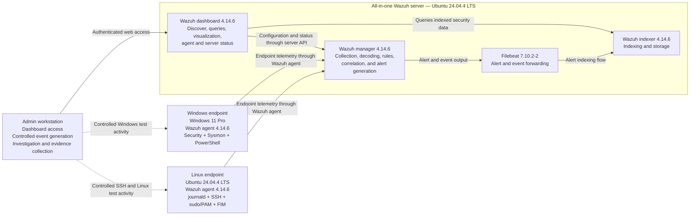
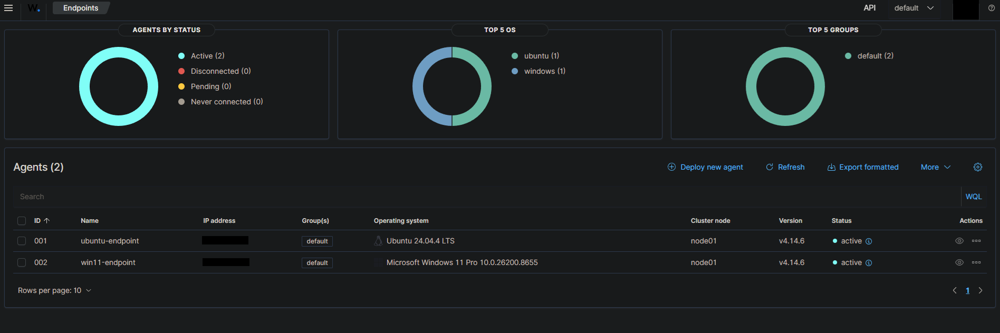
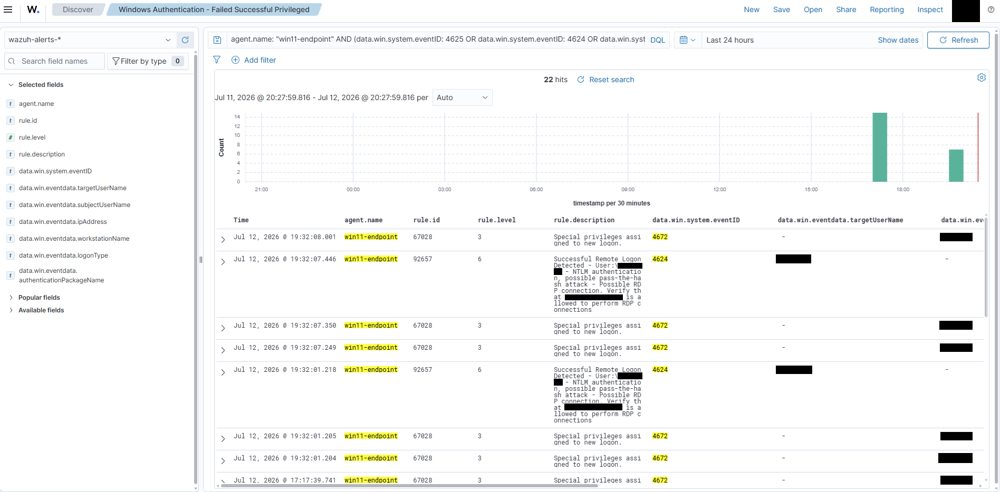
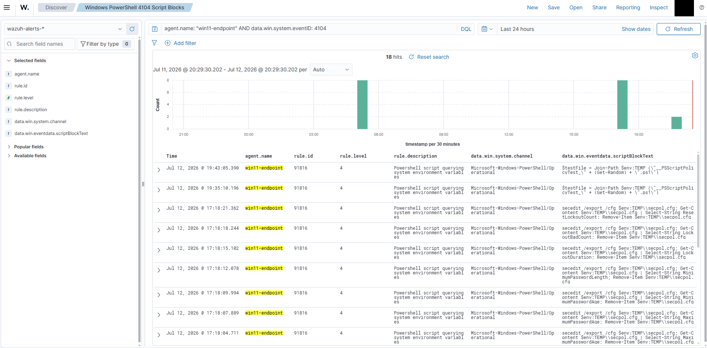
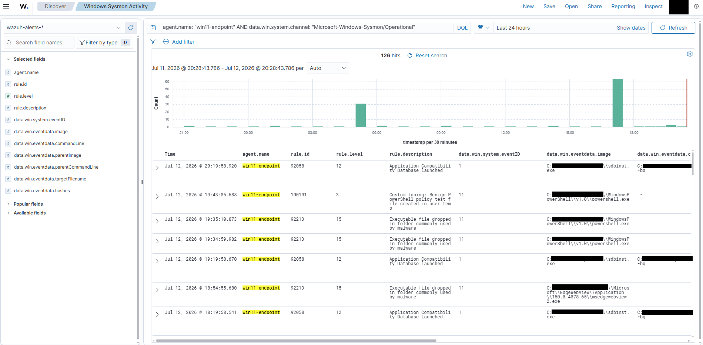
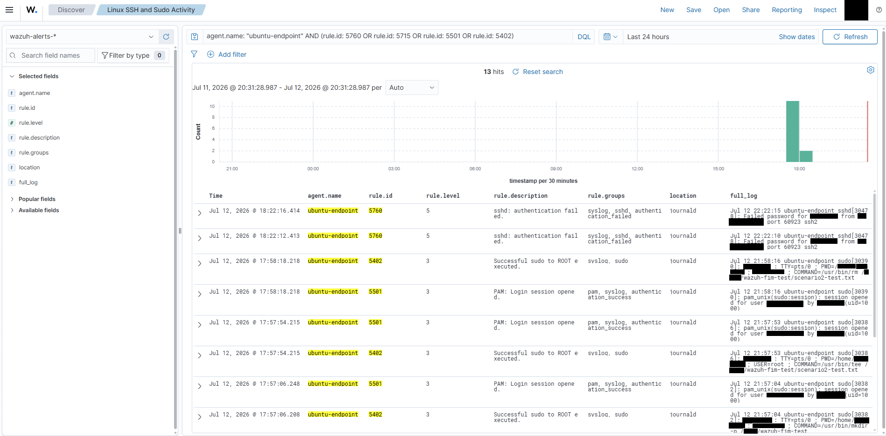
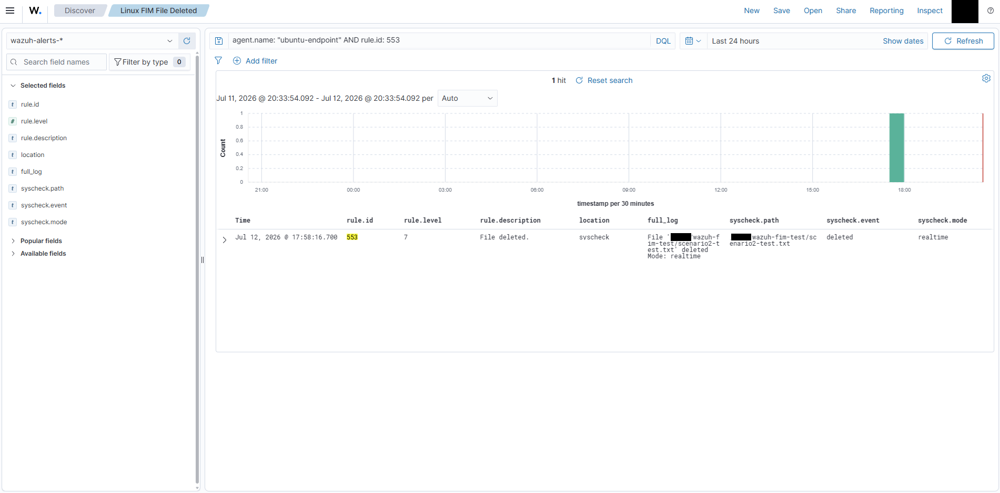
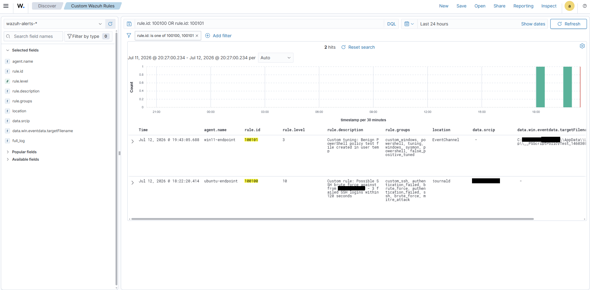

# Wazuh SOC Lab: Windows and Linux Threat Detection

## Overview

This repository documents a controlled home SOC lab built with Wazuh to monitor Windows and Linux endpoints. The project covers endpoint onboarding, telemetry validation, alert triage, investigation timelines, custom detection engineering, false-positive tuning, reusable dashboard searches, architecture documentation, and portfolio-quality evidence collection.

The goal was not simply to install Wazuh. The lab generated controlled security events, correlated related activity, validated custom rules through positive and negative testing, documented the exact software and active collection configuration, live-tested reusable DQL investigation queries through the Wazuh dashboard, mapped the verified telemetry and analyst workflows in a sanitized architecture diagram, and published reduced JSON excerpts derived from real alerts.

## Project Status

| Area | Status |
|---|---|
| Windows and Linux agent onboarding | Completed |
| Windows Security, Sysmon, and PowerShell telemetry | Completed |
| Linux SSH, sudo/PAM, and FIM telemetry | Completed |
| Two documented investigation scenarios | Completed |
| Custom SSH correlation rule | Validated end to end |
| PowerShell policy-test tuning rule | Narrowed and validated end to end |
| Public screenshot sanitization | Completed; metadata checks automated |
| Exact component and endpoint inventory | Completed |
| Sanitized active collection configuration | Completed |
| Reusable Wazuh dashboard query catalog | Ten queries live validated |
| Sanitized logical architecture diagram | Completed and GitHub-rendered |
| Sanitized decoded-alert examples | Four live-derived JSON excerpts validated |
| Repository audit workflow | JSON, XML, links, metadata, address, and secret-pattern checks enabled |

See [`VALIDATION.md`](VALIDATION.md) for evidence boundaries and test results. Supporting technical records are maintained in:

- [`docs/architecture.md`](docs/architecture.md)
- [`docs/environment-inventory.md`](docs/environment-inventory.md)
- [`docs/active-collection-config.md`](docs/active-collection-config.md)
- [`docs/dashboard-queries.md`](docs/dashboard-queries.md)
- [`docs/dashboard-query-validation.md`](docs/dashboard-query-validation.md)
- [`examples/alerts/README.md`](examples/alerts/README.md)

## Key Outcomes

- Onboarded and monitored Windows and Linux endpoints through Wazuh.
- Validated Windows Security, Sysmon, and PowerShell Script Block Logging telemetry.
- Validated Linux authentication, privilege-use, and File Integrity Monitoring alerts.
- Built investigation timelines from authentication, process, and file events.
- Created and validated a same-source SSH brute-force correlation rule.
- Investigated and narrowly tuned a recurring PowerShell policy-test alert.
- Validated the PowerShell tuning rule with one positive and three negative end-to-end tests.
- Validated the SSH correlation rule with baseline, threshold, different-source, and expired-window tests.
- Recorded exact server, agent, endpoint, Sysmon, and PowerShell versions.
- Published sanitized active collection excerpts and a Sysmon compiled-rules fingerprint.
- Live-validated ten reusable DQL searches for endpoint scoping, investigations, custom rules, and severity-based triage.
- Published a sanitized, maintainable logical architecture diagram showing verified telemetry and analyst flows.
- Published four compact, live-derived JSON alert excerpts with environment-specific identifiers removed.
- Normalized the PowerShell JSONL fixtures to clearly synthetic values and removed rendered source messages.
- Stripped text, XMP, EXIF, and comment metadata from all published PNG evidence.
- Added automated checks for JSON/JSONL, custom-rule XML structure, relative links, image metadata, private IPv4 addresses, retired source values, and common secret formats.

## Lab Architecture



| Component | Purpose |
|---|---|
| Wazuh server | Hosts the manager, Filebeat, indexer, and dashboard in an all-in-one deployment. |
| Windows endpoint | Provides Windows Security, Sysmon, PowerShell, and remote-authentication telemetry. |
| Linux endpoint | Provides SSH authentication, sudo/PAM, journald, package, command-monitoring, and File Integrity Monitoring telemetry. |
| Admin workstation | Provides dashboard access, controlled event generation, investigation, and sanitized evidence collection. |

The dotted lines represent controlled test activity rather than continuous telemetry transport. The diagram is logical, not a physical network map, and intentionally omits private addresses, credentials, enrollment material, unverified port assignments, and unverified transport settings. See [`docs/architecture.md`](docs/architecture.md) for detailed component responsibilities, primary telemetry flows, and evidence boundaries.



## Verified Environment

| Component | Verified version or state |
|---|---|
| Wazuh manager, indexer, and dashboard | `4.14.6` packages |
| Filebeat | `7.10.2-2` |
| Wazuh agents | `4.14.6` |
| Wazuh server OS | Ubuntu `24.04.4 LTS` |
| Linux endpoint OS | Ubuntu `24.04.4 LTS` |
| Windows endpoint | Windows 11 Pro `25H2`, build `26200.8875` |
| Sysmon | `15.21` |
| Windows PowerShell | `5.1.26100.8875` |

The full sanitized inventory, including kernels, architectures, service states, package revisions, and the Sysmon compiled-rules SHA-256 fingerprint, is maintained in [`docs/environment-inventory.md`](docs/environment-inventory.md).

## Telemetry Validated

### Windows endpoint

| Source | Event | Security value |
|---|---|---|
| Windows Security | 4625 | Failed authentication |
| Windows Security | 4624 | Successful logon |
| Windows Security | 4672 | Special privileges assigned to a new logon |
| Windows Security | 4688 | Process creation |
| PowerShell Operational | 4104 | Script block content |
| Sysmon | Event ID 1 | Process creation and process metadata |
| Sysmon | Event ID 11 | File creation |







### Linux endpoint

The Linux endpoint collected and forwarded:

- Failed SSH authentication
- PAM session activity
- Successful sudo activity
- File Integrity Monitoring changes





## Active Collection Configuration

The repository includes sanitized configuration excerpts for:

- Linux `journald` authentication collection
- Linux realtime and scheduled FIM coverage
- Windows Security EventChannel collection and its event-ID exclusion query
- Microsoft-Windows-Sysmon/Operational collection
- Microsoft-Windows-PowerShell/Operational collection
- Classic Windows PowerShell, Application, and System logs
- Local Machine Script Block Logging and Invocation Logging policies
- Empty manager-side `default` group `agent.conf`
- Sysmon compiled-rules byte count and SHA-256 fingerprint

See [`docs/active-collection-config.md`](docs/active-collection-config.md).

## Reusable Dashboard Queries

The repository publishes ten sanitized DQL searches for the Wazuh Discover or Threat Hunting view:

1. Endpoint alert scoping
2. Windows authentication and privileged-logon activity
3. Windows process creation and PowerShell script blocks
4. Sysmon process and file activity
5. Linux SSH, PAM, sudo, and FIM investigation timelines
6. SSH parent alerts and custom same-source correlation
7. PowerShell policy-test tuning alerts
8. Broader policy-test file activity
9. Custom-rule overview
10. High-severity alert triage

All ten queries parsed successfully and returned correctly scoped results against the active `wazuh-alerts-*` data view using DQL. Some optional target IDs were absent from the selected visible validation windows; those limitations are recorded explicitly rather than treated as proof that every listed ID appeared in one sample.

See [`docs/dashboard-queries.md`](docs/dashboard-queries.md) and [`docs/dashboard-query-validation.md`](docs/dashboard-query-validation.md).

## Sanitized Alert Examples

The repository includes four compact JSON excerpts derived from real alerts in the active lab:

| Example | Source | Demonstrated fields |
|---|---|---|
| Windows privileged logon | Security Event ID `4672`, rule `67028` | EventChannel provider, rule groups, account placeholders, logon identifier, and privilege list |
| PowerShell policy-test tuning | Custom rule `100101`, Sysmon Event ID `11` | Decoder, PowerShell image, and sanitized policy-test filename pattern |
| Linux SSH authentication failure | Parent rule `5760` | `sshd` decoder, source address, and destination account |
| SSH same-source correlation | Custom rule `100100` | Level `10`, frequency `3`, and sanitized same-source context |

Each excerpt was reduced from a live alert, validated as JSON, and reviewed for embedded identifiers in both structured fields and rule descriptions. They are evidence excerpts rather than complete raw-alert exports.

See [`examples/alerts/README.md`](examples/alerts/README.md).

## Investigation Scenario 1: Windows Remote Authentication and Discovery

### Scenario summary

A remote workstation attempted to authenticate to the Windows endpoint using a local administrative account. The investigation correlated a failed authentication event, a subsequent successful remote logon, privileged-logon activity, account-discovery commands, PowerShell activity, and Sysmon process telemetry.

### Evidence reviewed

| Event | Description | Analyst value |
|---|---|---|
| 4625 | Failed logon for a local administrator account | Identifies an authentication failure |
| 4624 | Successful remote logon using NTLM | Identifies successful remote authentication |
| 4672 | Special privileges assigned | Identifies a privileged logon session |
| 4688 | `net1 user` process creation | Shows account-discovery activity |
| 4104 | PowerShell script block activity | Preserves script content for review |
| Sysmon Event ID 1 | PowerShell process activity | Adds process image, command-line, and related process metadata |

### Analyst assessment

The activity was expected and intentionally generated in the lab. In a production environment, the same sequence could indicate unauthorized remote access followed by discovery. Recommended analyst actions would include validating the source workstation, confirming that the account use was authorized, reviewing account privileges, and hunting for additional discovery or lateral-movement indicators.

## Investigation Scenario 2: Linux SSH, Sudo, and File Integrity Monitoring

### Scenario summary

A failed SSH login was generated against the Linux endpoint. The investigation then reviewed sudo/root activity and the deletion of a file from a Wazuh-monitored directory.

### Evidence reviewed

| Wazuh rule | Description | Analyst value |
|---|---|---|
| 5760 | Failed SSH authentication | Detects an SSH login failure |
| 5501 | PAM session opened | Records session activity |
| 5402 | Successful sudo to root | Detects privileged command execution |
| 553 | File deleted | Detects deletion from a monitored path |

### Analyst assessment

The activity was expected and intentionally generated in the lab. In a production environment, failed SSH authentication followed by sudo/root activity and deletion of a monitored file would warrant validation of the source, review of shell and authentication history, confirmation that the activity was authorized, and investigation of the deleted file.

## Detection Engineering

### Custom rule 100100: SSH brute-force correlation

Rule `100100` raises the alert level when Wazuh observes three matches of parent rule `5760` from the same source IP within 120 seconds.

| Field | Value |
|---|---|
| Rule ID | 100100 |
| Severity | Level 10 |
| Trigger | 3 failed SSH logins within 120 seconds from the same source IP |
| Source rule | 5760 — SSH authentication failed |
| MITRE ATT&CK | T1110 — Brute Force |
| Purpose | Escalate repeated authentication failures into a higher-priority alert |

#### End-to-end validation

| Test | Observed result | Status |
|---|---|---|
| One failed password against a valid non-privileged account | Rule `5760`, level 5; no custom alert | Passed |
| Two same-source failures within 120 seconds | Two rule `5760` alerts; no custom alert | Passed |
| Third same-source failure within 120 seconds | Rule `100100`, level 10; `rule.frequency: 3` | Passed |
| Three failures split across two sources | All remained rule `5760`; no custom alert | Passed |
| Two failures, wait over 120 seconds, then one more | All remained rule `5760`; no custom alert | Passed |

A nonexistent username followed built-in rule `5710`, so the correlation tests used a dedicated valid non-privileged account with deliberately incorrect passwords. The account was removed after testing.

This threshold is intentionally sensitive for a small lab. A production threshold should be tuned for expected login behavior, Internet exposure, account-lockout policy, and acceptable alert volume.

See [`rules/tests/ssh-brute-force-validation.md`](rules/tests/ssh-brute-force-validation.md).

### Custom rule 100101: PowerShell policy-test tuning

Rule `100101` lowers the severity of a specific Sysmon Event ID 11 alert inherited from built-in rule `92213`. It preserves visibility while reducing noise only when all validated conditions match.

| Field | Required value |
|---|---|
| Rule ID | 100101 |
| Severity | Level 3 |
| Parent rule | 92213 |
| Event type | Sysmon Event ID 11 |
| Target path | Exact user `AppData\Local\Temp` path pattern |
| Filename | `__PSScriptPolicyTest_*.ps1` |
| Creating image | Windows PowerShell 5.1 executable path |

#### End-to-end validation

| Test | Observed result | Status |
|---|---|---|
| Expected user-Temp policy-test file created by Windows PowerShell | Rule `100101`, level 3 | Passed |
| Matching filename under `C:\Windows\Temp` | Built-in rule `92201`, level 9 | Passed |
| Unrelated `.ps1` in the user Temp directory | Built-in rule `92213`, level 15 | Passed |
| Matching user-Temp filename created by `cmd.exe` | Built-in rule `92213`, level 15 | Passed |

All four live events decoded through `windows_eventchannel` as Sysmon Event ID 11. Only the intended positive event matched rule `100101`. The JSONL corpus is a normalized field-review fixture and is not presented as a substitute for the live EventChannel tests.



## Evidence and Validation

The screenshots are representative evidence from the controlled lab, and the JSON examples are reduced decoded-alert excerpts. Neither replaces complete raw-alert exports. Environment-specific identifiers were redacted before publication.

The repository distinguishes between:

- **Observed lab behavior:** activity reviewed in the Wazuh dashboard during the original project.
- **Published evidence:** sanitized screenshots, reduced decoded-alert excerpts, investigation summaries, architecture documentation, configuration excerpts, query catalogs, and test matrices.
- **Live revalidation:** controlled Windows and Linux events rerun through active agent pipelines and DQL searches executed through the dashboard.
- **Verified reproducibility data:** exact versions, service states, active collection sources, policy state, logical service flows, and a Sysmon configuration fingerprint.

See:

- [`VALIDATION.md`](VALIDATION.md)
- [`docs/architecture.md`](docs/architecture.md)
- [`docs/environment-inventory.md`](docs/environment-inventory.md)
- [`docs/active-collection-config.md`](docs/active-collection-config.md)
- [`docs/dashboard-queries.md`](docs/dashboard-queries.md)
- [`docs/dashboard-query-validation.md`](docs/dashboard-query-validation.md)
- [`examples/alerts/README.md`](examples/alerts/README.md)
- [`rules/tests/README.md`](rules/tests/README.md)
- [`rules/tests/expected-results.md`](rules/tests/expected-results.md)
- [`rules/tests/ssh-brute-force-validation.md`](rules/tests/ssh-brute-force-validation.md)
- [`screenshots/README.md`](screenshots/README.md)

## Skills Demonstrated

- Wazuh deployment and administration
- Windows and Linux endpoint monitoring
- Sysmon deployment and validation
- PowerShell Script Block Logging
- Windows Security audit-policy validation
- Linux SSH, sudo, PAM, and journald analysis
- File Integrity Monitoring
- Alert triage and investigation timelines
- OpenSearch Dashboards DQL investigation searches
- Logical security architecture documentation
- Detection engineering with custom Wazuh rules
- False-positive investigation and narrow severity tuning
- Positive and negative detection testing
- Correlation threshold and grouping validation
- Decoded-alert field analysis and evidence reduction
- Configuration inventory and reproducibility documentation
- Security evidence sanitization
- Automated repository validation and publication-safety checks

## Lessons Learned

- Alert severity does not replace investigation context.
- Related authentication, privilege, process, and file events are more meaningful when reviewed as a timeline.
- Detection engineering includes both escalation and noise reduction.
- Correlation rules must be tested below threshold, at threshold, across different grouping values, and beyond the timeframe.
- Invalid-user and valid-user SSH failures can follow different built-in Wazuh rule paths.
- False-positive tuning must require enough context to avoid suppressing unrelated suspicious behavior.
- Decoder context matters when testing Wazuh rules; generic JSON replay does not always reproduce the live EventChannel rule chain.
- Reusable dashboard searches should be tested for parsing, expected results, unrelated-result exclusion, and safe visible columns.
- Fields useful during a private investigation are not automatically safe to display in public evidence.
- Architecture diagrams should distinguish verified logical flows from unverified physical topology, ports, transport settings, and integrations.
- Rule descriptions can contain embedded identifiers even when structured alert fields have already been sanitized.
- Image sanitization includes embedded metadata as well as visible pixels.
- Exact version and active-configuration capture materially improves reproducibility.
- Public portfolio evidence should demonstrate results without exposing live network or account information.

## Limitations

- The repository contains representative screenshots and four reduced JSON alert excerpts rather than complete sanitized raw-alert exports.
- The normalized JSONL fixture documents rule-relevant field combinations but does not reproduce the Windows EventChannel decoder chain.
- Rule `100100` uses an intentionally sensitive lab threshold and is not a universal production recommendation.
- Rule `100101` was validated against Windows PowerShell 5.1; PowerShell 7 requires separate review and testing.
- The published evidence supports remote Windows authentication but does not independently prove that the session used RDP.
- The Sysmon fingerprint proves the compiled rules state but does not publish or reconstruct the full underlying Sysmon configuration.
- Saved-object exports are intentionally excluded because they may contain internal data-view IDs, tenant metadata, or substituted local values.
- The architecture is a sanitized logical diagram and does not claim unverified physical topology, port assignments, transport settings, or external integrations.

## Repository Layout

```text
wazuh-soc-lab
├── README.md
├── VALIDATION.md
├── LICENSE
├── .github
│   └── workflows
│       └── repository-audit.yml
├── docs
│   ├── active-collection-config.md
│   ├── architecture.md
│   ├── dashboard-queries.md
│   ├── dashboard-query-validation.md
│   └── environment-inventory.md
├── examples
│   └── alerts
│       ├── README.md
│       ├── linux-ssh-authentication-failure.json
│       ├── ssh-same-source-correlation.json
│       ├── sysmon-policy-test-tuning.json
│       └── windows-privileged-logon.json
├── rules
│   ├── local_rules.xml
│   └── tests
│       ├── README.md
│       ├── expected-results.md
│       ├── powershell-policy-test-events.jsonl
│       └── ssh-brute-force-validation.md
└── screenshots
    ├── README.md
    ├── wazuh-agents-overview.png
    ├── windows-authentication-chain.png
    ├── windows-powershell-4104.png
    ├── windows-sysmon-activity.png
    ├── linux-ssh-sudo-activity.png
    ├── linux-fim-file-deleted.png
    └── custom-wazuh-rules.png
```

## Safety and Sanitization

This project was completed in a controlled lab environment. All alerts and investigation scenarios were intentionally generated for learning and validation. Published screenshots are flattened images with private addresses, account names, and environment-specific identifiers redacted, and prohibited text/XMP/EXIF metadata chunks removed. The architecture diagram uses generic component labels and verified logical flows only. Reduced JSON examples use stable placeholders, while the JSONL test corpus uses clearly synthetic fixture values and omits complete rendered event messages.

The repository audit workflow checks current tracked content for malformed JSON or XML, broken relative Markdown links, prohibited PNG metadata, private IPv4 addresses, retired source values, and common secret formats.

Do not publish enrollment keys, credentials, certificates, complete internal addressing, unsanitized alert exports, saved-object exports containing local identifiers, or complete private service configuration from a live Wazuh environment.

## References

- [Wazuh architecture](https://documentation.wazuh.com/current/getting-started/architecture.html)
- [Wazuh components](https://documentation.wazuh.com/current/getting-started/components/index.html)
- [Wazuh custom rules](https://documentation.wazuh.com/current/user-manual/ruleset/rules/custom.html)
- [Wazuh rules syntax](https://documentation.wazuh.com/current/user-manual/ruleset/ruleset-xml-syntax/rules.html)
- [Wazuh rule testing](https://documentation.wazuh.com/current/user-manual/ruleset/testing.html)
- [OpenSearch Dashboards Query Language](https://docs.opensearch.org/latest/dashboards/dql/)
- [Microsoft Sysmon](https://learn.microsoft.com/sysinternals/downloads/sysmon)
- [MITRE ATT&CK T1110 — Brute Force](https://attack.mitre.org/techniques/T1110/)

## License

This project is licensed under the [MIT License](LICENSE).
