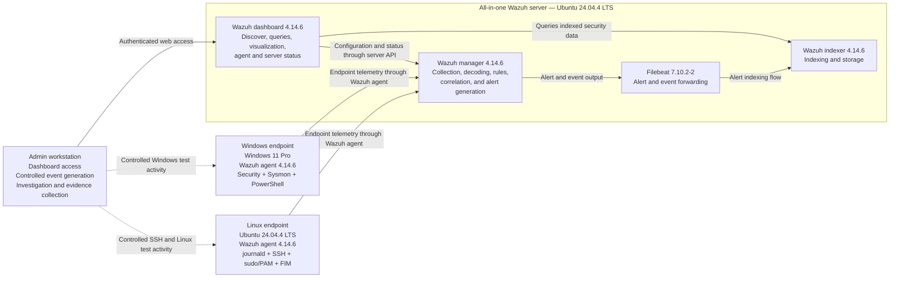

# Wazuh SOC Lab Architecture

## Purpose

This document provides a sanitized logical architecture diagram for the active Wazuh SOC lab. It shows the monitored endpoints, the all-in-one Wazuh server components, the analyst workstation, and the direction of the primary telemetry and investigation flows.

The diagram deliberately excludes private IP addresses, usernames, credentials, certificates, enrollment keys, and environment-specific identifiers.

## Logical architecture

## Component responsibilities

| Component | Verified role in this lab |
|---|---|
| Admin workstation | Accesses the Wazuh dashboard, runs DQL investigations, generates controlled test activity, and prepares sanitized evidence. |
| Windows endpoint | Collects Windows Security, Sysmon, Microsoft-Windows-PowerShell/Operational, classic Windows PowerShell, Application, and System events through the Wazuh agent. |
| Linux endpoint | Collects `journald` authentication activity, SSH and sudo/PAM events, package logs, command-monitoring output, and File Integrity Monitoring data through the Wazuh agent. |
| Wazuh manager | Receives agent events, decodes telemetry, evaluates built-in and custom rules, performs correlation, and generates alerts. |
| Filebeat | Reads Wazuh server alert and event output and forwards it to the indexer. |
| Wazuh indexer | Indexes and stores the alert data used for search and investigation. |
| Wazuh dashboard | Queries indexed alert data and uses the Wazuh server API for configuration and status information. |

## Primary telemetry flows

### Windows telemetry

1. Windows records Security, PowerShell, and Sysmon events.
2. The local Wazuh agent reads the configured EventChannel sources.
3. The agent forwards collected events to the Wazuh manager.
4. The manager decodes the events and evaluates built-in and custom rules.
5. Filebeat forwards generated alert and event output to the indexer.
6. The dashboard queries the indexed data for investigation and visualization.

### Linux telemetry

1. Linux records authentication, SSH, sudo/PAM, package, command-monitoring, and FIM activity.
2. The local Wazuh agent collects the configured sources, including `journald` and the active FIM paths.
3. The agent forwards collected events to the Wazuh manager.
4. The manager decodes the events and evaluates built-in and custom rules, including the same-source SSH correlation rule.
5. Filebeat forwards generated alert and event output to the indexer.
6. The dashboard queries the indexed data for investigation and visualization.

## Analyst workflow

The admin workstation has two distinct roles:

- **Investigation path:** authenticated browser access to the dashboard for Discover/DQL searches, alert review, and agent or server status.
- **Controlled test path:** deliberate Windows and Linux actions used to validate telemetry, custom rules, correlation behavior, and negative cases.

The dotted lines in the diagram represent controlled test activity rather than continuous telemetry transport.

## Deployment scope and evidence boundaries

- The Wazuh manager, Filebeat, indexer, and dashboard were verified as active services on the same Ubuntu server, so the diagram models an all-in-one lab deployment.
- The diagram is logical rather than a physical network map. Components shown inside the server boundary are colocated services, not separate hosts.
- Port numbers and transport settings are intentionally omitted because this repository did not independently audit every active listener and connection against its configured defaults.
- No Internet-facing exposure, reverse proxy, external identity provider, email relay, active-response automation, or third-party threat-intelligence flow is claimed by this diagram.
- The diagram documents only components and flows supported by the collected inventory, active configuration excerpts, dashboard validation, and end-to-end rule testing.

## Related documentation

- [`environment-inventory.md`](environment-inventory.md)
- [`active-collection-config.md`](active-collection-config.md)
- [`dashboard-queries.md`](dashboard-queries.md)
- [`dashboard-query-validation.md`](dashboard-query-validation.md)
- [`../VALIDATION.md`](../VALIDATION.md)
- [`../rules/tests/ssh-brute-force-validation.md`](../rules/tests/ssh-brute-force-validation.md)

## References

- [Wazuh architecture and component communication](https://documentation.wazuh.com/current/getting-started/architecture.html)
- [Wazuh components](https://documentation.wazuh.com/current/getting-started/components/index.html)
